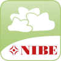

  

# homebridge-nibe

## Nibeuplink plugin for homebridge

This homebridge plugin retrieves data from a Nibe heat pump from Nibe Uplink.

### Plugin configuration

Whole setup instruction is available on plugin configuration page in homebridge. There is step by step description how to get required parameters.

### Supported devices and accessories

**Device list**

* F370 CU 3x400V
* F750 CU 3x400V
* F1145-10 PC
* F1245-6 E PC EM
* F1255-6 E EM
* F1255-6 R PC EM 3x400V
* F2040-12
* F2120-12
* VVM 500
* VVM 320 E

*If your device is not on the list please install the plugin, configure it and you will see error log in homebridge with details how to create "add new device" issue*

<table>
    <thead>
        <tr>
            <th>Accessory</th>
            <th>Description</th>
            <th>Device</th>
        </tr>
    </thead>
    <tbody>
        <tr>
            <td>outdoor-temperature</td>
            <td>BT1 outdoor temperature</td>
            <td>
                <ul>
                    <li>F1145-10 PC - v0.0.7</li>
                    <li>F750 CU 3x400V - v0.0.13</li>
                    <li>F1145-10 PC - v0.0.14</li>
                    <li>F750 CU 3x400V - v0.0.14</li>
                    <li>VVM 500 - v0.0.14</li>
                    <li>F2120-12 - v0.0.14</li>
                    <li>F1245-6 E PC EM - v0.0.14</li>
                    <li>F370 CU 3x400V - v0.0.14</li>
                    <li>VVM 320 E - v0.0.14</li>
                    <li>F2040-12 - v0.0.14</li>
                    <li>F1255-6 E EM - v0.0.15</li>
                    <li>F1255-6 R PC EM 3x400V - v0.0.16</li>
                </ul>
            </td>
        </tr>
        <tr>
            <td>hot-water</td>
            <td>Hot water temperature with temporary lux on activation</td>
            <td>
                <ul>
                    <li>F1145-10 PC - v0.0.8</li>
                    <li>F750 CU 3x400V - v0.0.13</li>
                    <li>F1145-10 PC - v0.0.14</li>
                    <li>F750 CU 3x400V - v0.0.14</li>
                    <li>VVM 500 - v0.0.14</li>
                    <li>F1245-6 E PC EM - v0.0.14</li>
                    <li>F370 CU 3x400V - v0.0.14</li>
                    <li>VVM 320 E - v0.0.14</li>
                    <li>F1255-6 E EM - v0.0.15</li>
                    <li>F1255-6 R PC EM 3x400V - v0.0.16</li>
                </ul>
            </td>
        </tr>
    </tbody>
</table>

## Roadmap

https://github.com/hp-net/homebridge-nibe/projects/1

## Configuration

Whole configuration can be done via homebridge ui and this is **recommended** way to do it.

However you can also make all changes directly in homebridge config.json file. Below you can find description of all options.
------------------
name optional default description

"platform": "Nibe",
"identifier": "a9762d14a2f64396a2cf844a03202d97",
"secret": "w4ALf3WYyJ92+yHAXbwwtJGCN2CiTvnFbTgtiEwMVjM=",
"authCode": "XXXX",
"systemIdentifier": "107050",
"callbackUrl": "https://hp-net.github.io/homebridge-nibe/nibe.html",
"language": "en",
"pollingPeriod": 60,
"disabledAccessories": []
------------------

## Sponsorship & support

*If you are using this project please consider sponsoring it's further development & bug fixes*

